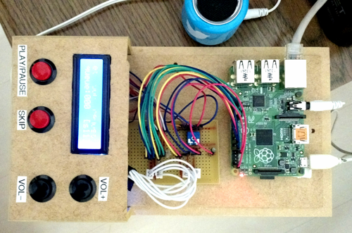
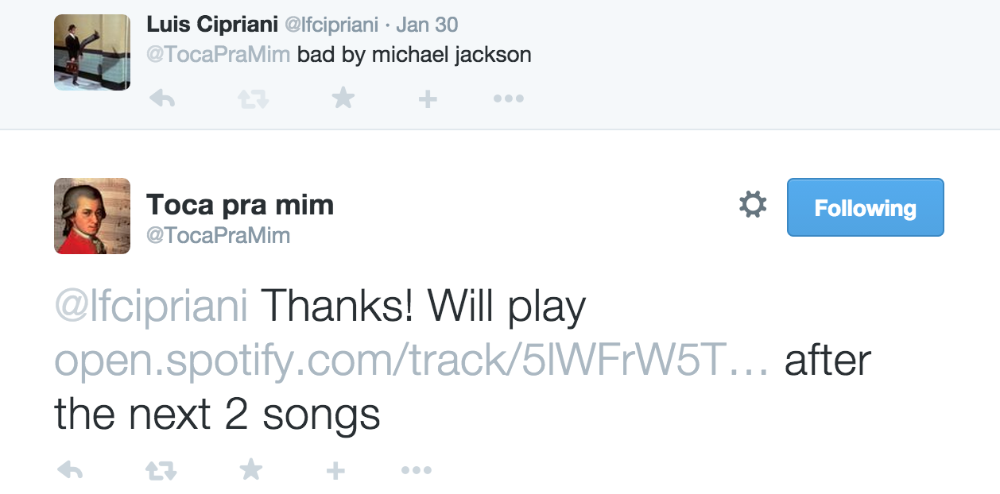
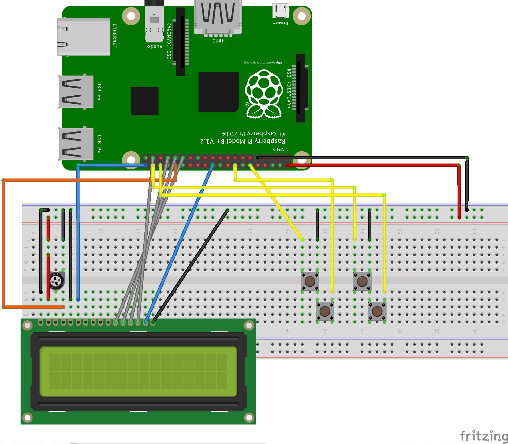

tweet-jukebox
=============

A jukebox powered by tweets on a Raspberry Pi.

                    +---------------------------------+
                    |                                 |
    Tweet           | Raspberry Pi                    |
    (music request) |                                 |
       +            | +-----------+      +----------+ |           \o/ Music powered by:
       |            | | Twitter   | +--> | Mopidy   | |             Spotify
       +--------------> Streaming |      | Server   +------------>  Youtube
         network    | | API       | <--+ |          | |  audio      Soundcloud
                    | +-----------+      +----------+ |
                    |                                 |
                    +---------------------------------+

## Device

## Usage

Tweet request syntax:

    @jukebox_user song name [by artist] [#spotify|#youtube|#soundcloud]

or

    @jukebox_user [link to a spotify, youtube or soundcloud music]

* search will play the first result found for the query
* artist is optional, but can help to search the right song
* you can restrict the search to a specific source by using the hashtag with source name
* if no music #source is specified, it will play the first result found on Spotify, then Youtube, then Soundcloud

A pre-configured admin user can send DM messages to jukebos user to #play, #pause, #next (skip song).

## Resources needed

* [Mopidy](https://www.mopidy.com/) music server 
* Mopidy [Spotify](https://github.com/mopidy/mopidy-spotify), [Youtube](https://github.com/dz0ny/mopidy-youtube), [Soundcloud](https://github.com/mopidy/mopidy-soundcloud) plugins
* Node.js
* Twitter [REST](https://dev.twitter.com/rest/public) and [Streaming](https://dev.twitter.com/streaming/overview) API
* Raspberry Pi
* Network access (via ethernet or wifi)

You can run on any device and OS that supports these softwares. I'm running everything on a Raspberry Pi

## Schematic

More instructions soon...

Copyright 2015 Luis Cipriani. Under Apache v2 License terms

